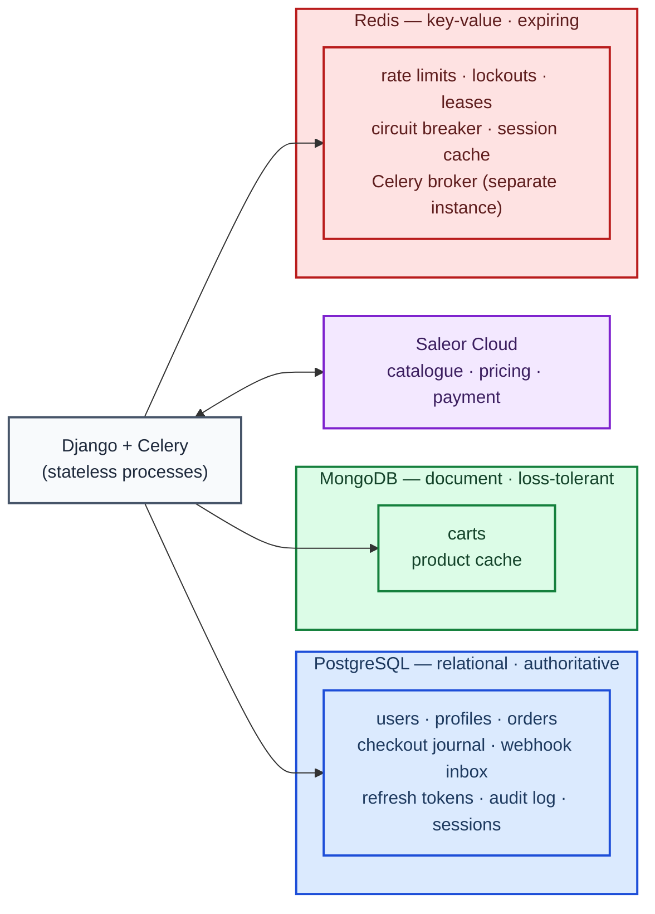
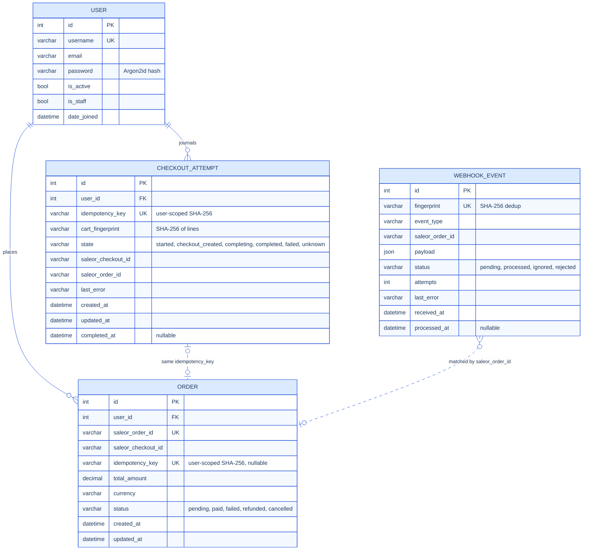
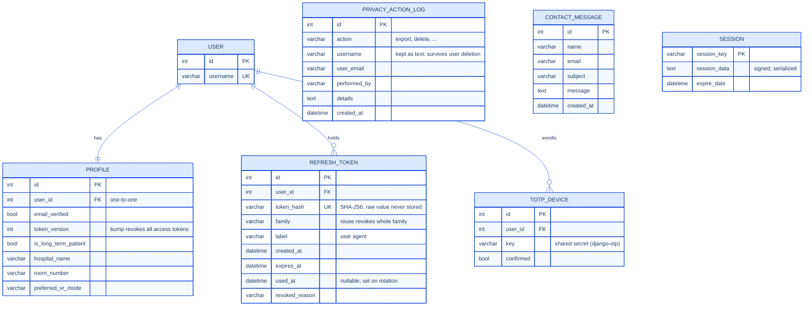
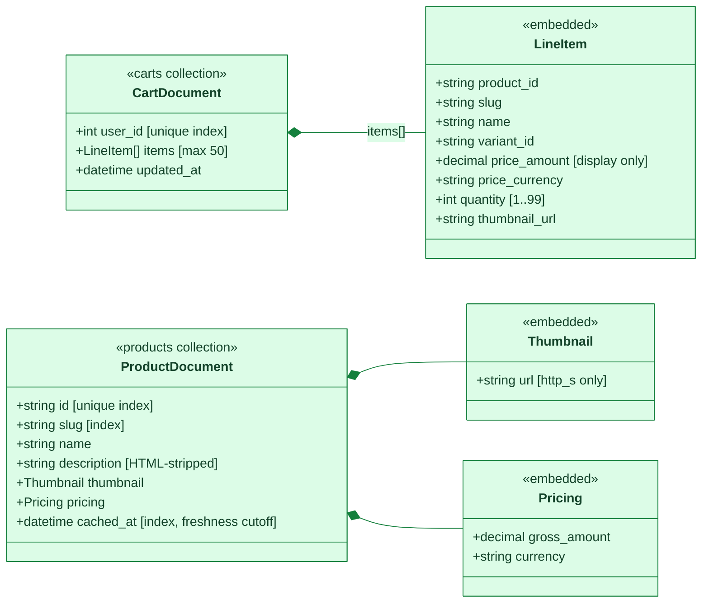
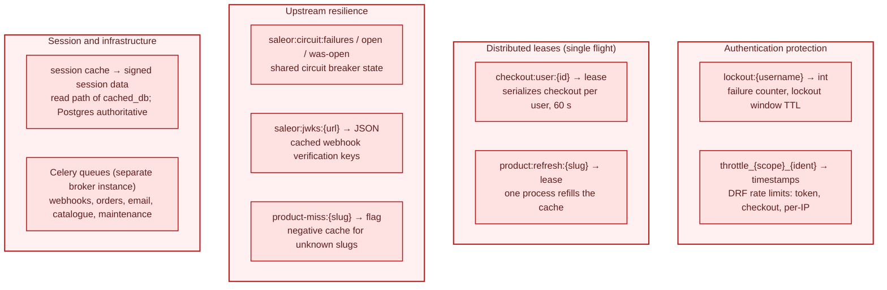

# Data model and use cases

Eve is a Django web application for browsing and purchasing virtual-reality
experiences, aimed at long-term hospital patients. It combines Django
accounts and orders with a Saleor Cloud catalogue, MongoDB-backed carts,
Redis-backed shared state, and signed Saleor order webhooks.

The application uses **polyglot persistence**: three databases with three
different data models, each chosen for the shape and lifetime of the state
it holds. The rule that keeps this coherent: **only PostgreSQL is
authoritative** — losing MongoDB costs carts and a cache; losing Redis costs
throttling precision and cached sessions; neither can lose an order or a
payment state. The full rationale, including the rejected single-database
alternative, is in [ADR-0003](adr/0003-three-datastores.md).

| Store | Model type | Holds | Why this model |
|---|---|---|---|
| **PostgreSQL** | Relational (SQL) | Users, profiles, orders, checkout journal, webhook inbox, refresh tokens, audit log, sessions | Transactions, constraints, and row locking for everything involving money or identity |
| **MongoDB** | Document (NoSQL) | Carts, product cache | Nested, schemaless documents mirroring Saleor's product shape; atomic array operators for concurrent cart writes |
| **Redis** | Key-value (NoSQL) | Rate limits, lockouts, leases, circuit breaker, caches, Celery broker | Fast shared expiring state across all web and worker processes |

## Data volume and provenance

The repository does **not** contain a customer dataset or a database dump.
Most persistent data is created through normal use of the application:
accounts are registered by users, carts are created when users add products,
and orders are recorded when a checkout or a Saleor webhook is processed.
Consequently, the exact number of operational records depends on the deployed
environment and changes over time; it should be measured from that environment
rather than inferred from the source code.

The data used while developing and validating Eve is small and has the
following provenance:

| Data | Amount | Origin and generation method |
|---|---:|---|
| Saleor staging catalogue | At least 1 configured product (`VR Forests`) during project setup | Entered manually through the Saleor Dashboard. Saleor is the authoritative catalogue; products are fetched through GraphQL and copied temporarily into MongoDB as a cache. |
| Built-in catalogue fallback | 2 product descriptions | Hand-written constants in `ecommerce/views.py`. They are displayed only when Saleor is unavailable and MongoDB has no usable cached products. They are not inserted into any database and cannot be returned by the REST API. |
| Default load-test dataset | 20 users, 20 profiles, 100 pending orders and 1 cached product | Deterministically generated on staging by `python manage.py loadtest_seed --users 20 --orders-per-user 5`. Usernames are `loadtest_0` through `loadtest_19`; orders use the `LOADTEST-<username>-<number>` format. |
| Full 200-user validation dataset | 200 users, 200 profiles, 1,000 pending orders and 1 cached product | Generated by the same command with `--users 200 --orders-per-user 5 --with-webhook-key`. The optional flag also generates a temporary 2,048-bit RSA key for signed webhook traffic and places only its public JWKS representation in the staging cache. |
| Redis test state | Variable and short-lived | Produced automatically by logins, throttles, cache leases, sessions, Celery and the Saleor circuit breaker. Every application key expires; Redis is not treated as a permanent dataset. |

The 200-user dataset was used for the controlled staging load test on
31 July 2026. After the test, `python manage.py loadtest_seed --cleanup`
removed 1,400 PostgreSQL rows (200 users, their 200 profiles and 1,000
orders), the synthetic MongoDB product and the temporary webhook key. Thus,
that generated dataset is **not retained** as application data. The seed
command also refuses to run when `DJANGO_ENV=prod`, preventing synthetic
load-test records from being inserted into production accidentally.

MongoDB product volume is bounded by the Saleor catalogue and cache lifetime;
cart volume is at most one cart document per user. Redis volume is bounded by
key expiry and current traffic. PostgreSQL is the only long-term application
store, and its volume grows with registered users, orders, webhook inbox
records, token records, contact messages and audit events. No personally
identifiable production data is generated merely to populate the system.

## Use cases

Status: ✅ implemented · 🚧 implemented behind a flag · ❌ not implemented.

| Use case | Data touched | Status |
|---|---|---|
| Register an account and verify the email address | PostgreSQL (`User`, `Profile`) | ✅ Implemented |
| Log in / log out / reset password (rate-limited, with lockout) | PostgreSQL, Redis (counters) | ✅ Implemented |
| Manage profile (patient flag, hospital, room, VR preference) | PostgreSQL (`Profile`) | ✅ Implemented |
| Administrator login with TOTP MFA | PostgreSQL (`TOTPDevice`) | ✅ Implemented |
| Browse the catalogue and view products | MongoDB (product cache), Saleor on miss | ✅ Implemented |
| Add to / remove from / view the cart | MongoDB (`carts`) | ✅ Implemented |
| Place an order (idempotent, journaled checkout) | PostgreSQL (`CheckoutAttempt`, `Order`), Saleor | 🚧 Implemented; disabled by default until an installation verifies its own Saleor environment (`CHECKOUT_ENABLED`) |
| View order history | PostgreSQL (`Order`) | ✅ Implemented |
| Process paid / refunded / cancelled order events | PostgreSQL (`WebhookEvent`, `Order`) | ✅ Implemented |
| Recover lost orders via reconciliation | PostgreSQL, Saleor | ✅ Implemented |
| Issue / refresh / revoke API tokens | PostgreSQL (`RefreshToken`) | ✅ Implemented |
| Consume everything above via the REST API (`/api/v1/`) | Same stores as the HTML views | ✅ Implemented |
| Export or delete a user's data (privacy workflows, audited) | PostgreSQL (`PrivacyActionLog`), MongoDB | ✅ Implemented (operator-run) |
| Send a contact message | PostgreSQL (`ContactMessage`) | ✅ Implemented |
| Live payment capture in production | Saleor payment app | ❌ Not implemented — requires configuring a Saleor payment application and accepting a real low-value checkout first |
| Multi-currency carts | MongoDB, Saleor | ❌ Not implemented — a single Saleor channel makes mixed currencies unreachable; totals for that case are known-wrong and tracked in the threat model (checkout would still price correctly, since Saleor recalculates) |
| Multi-channel / multi-region catalogue | Saleor | ❌ Not implemented |

## Where each kind of state lives

## PostgreSQL — relational model (blue)

Split into two diagrams for readability. `PK` = primary key, `FK` = foreign
key, `UK` = unique constraint. Every table also has an implicit
auto-increment `id` primary key unless another PK is shown.

### Commerce: orders, checkout journal, webhook inbox

`Order.status` transitions are allow-listed in code (for example
`refunded` is terminal); a webhook proposing an illegal transition is
rejected and logged. `WEBHOOK_EVENT` is the durable inbox: rows are
committed before the Celery task is published, so a broker failure loses
nothing.

### Identity, credentials, audit

`PRIVACY_ACTION_LOG` deliberately stores the username as plain text rather
than a foreign key, so the audit trail survives the deletion it records.
`SESSION` is Django's `cached_db` engine: reads come from Redis, writes are
mirrored here, so PostgreSQL remains the session source of truth.

## MongoDB — document model (green)

Two collections. Freshness of the product cache is enforced **at query
time** (`cached_at >= now - TTL`) rather than by deleting documents, so
stale documents remain available as a fallback during a Saleor outage.
Indexes are created by `manage.py ensure_indexes`.

Why a document store fits here: the cart is one nested document per user,
mutated with **single atomic operators** (`$inc`, guarded `$push`, `$pull`,
`$set` with array filters) so concurrent requests can never lose each
other's writes; the `$push` carries an `$expr` size guard so a concurrent
burst cannot race past the 50-item cap. Product documents mirror Saleor's
nested GraphQL shape after validation and sanitization — no schema
migration is needed when upstream fields change, and the whole collection
can be dropped and rebuilt at will. Prices in both collections are
**display-only**: checkout re-prices everything server-side via Saleor.

## Redis — key-value model (red)

All values are JSON or plain counters — pickle is disabled so a compromised
Redis cannot execute code. Every key expires. The Celery broker runs on a
**separate** Redis instance from the cache, because the cache may evict
under memory pressure and a broker must not.

Why a key-value store fits here: every entry is *shared, expiring, and
disposable* — counters that must be visible to all web instances so a
lockout on one replica holds on all of them, leases that guarantee a single
flight across processes, and caches whose loss degrades performance but
never correctness.

## Non-trivial aspects of the implementation

- **Concurrency without transactions in MongoDB:** single atomic update
  operators with array filters and an `$expr` size guard replace
  read-modify-write cycles entirely.
- **Unique constraints as concurrency control in PostgreSQL:** the
  user-scoped idempotency key makes double-submits collapse into one order;
  webhook processing takes row locks and enforces an allow-listed state
  machine.
- **The transactional inbox:** webhook events are committed to PostgreSQL
  before the queue is involved, with a recovery schedule republishing
  pending rows — Redis transports work, PostgreSQL records it.
- **Split authority per datum:** sessions are read from Redis but owned by
  PostgreSQL; product data is served from MongoDB but owned by Saleor;
  prices are displayed from cache but only ever charged from a live
  server-side recalculation.

## Related documentation

- [ADR-0003 — why three datastores](adr/0003-three-datastores.md)
- [Threat model](THREAT_MODEL.md) — trust boundaries between the stores
- [Security measures](SECURITY_MEASURES.md) — store-specific protections
- [Setup guide](SETUP.md) — initializing all three databases
