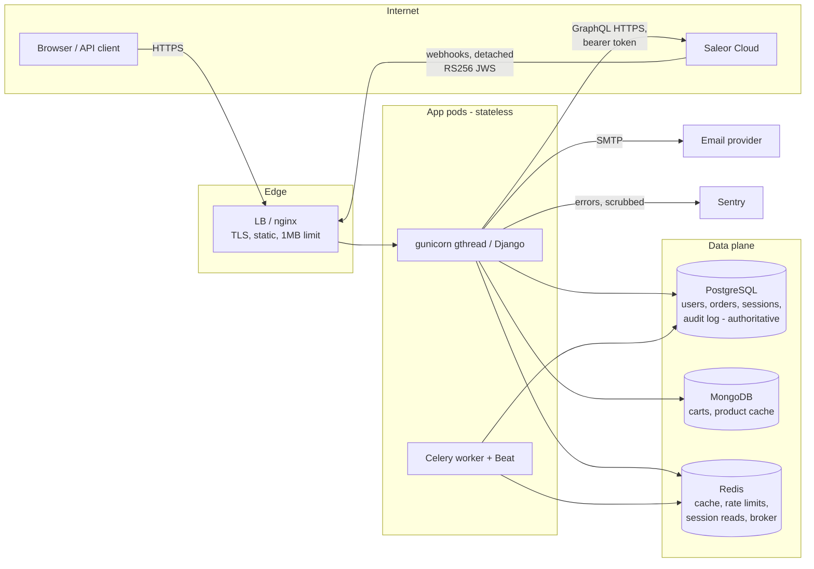

# Threat Model — Eve

## Scope and provenance

| Field | Value |
|---|---|
| **Assessed commit** | `94a7b8c` (+ this change) |
| **Branch** | `capacity-analysis` |
| **Assessment date** | 2026-07-31 |
| **Test suite at that commit** | 258 tests, 256 passing, 2 skipped (Saleor integration, requires a live instance) |

**In scope:** the Django application (storefront, REST API v1, Celery
tasks), its three data stores, the Saleor integration (GraphQL egress and
RFC 7797 detached-JWS webhook ingress), and the deployment architecture in
docs/DEPLOYMENT.md.

**Out of scope:** Saleor Cloud's own security posture, Railway's platform
isolation, MongoDB Atlas / PostgreSQL host hardening, and the payment
gateway (not yet integrated — see R6).

**Method:** data-flow and STRIDE per trust boundary, then OWASP Top 10
(2021), an e-commerce-specific pass (section 6), and secure-header/session
checks. Every claim below is tagged with an assurance level (next section).

## Assurance levels

Earlier revisions of this document marked controls "Pass", which conflated
four very different degrees of confidence. Every claim now carries one of:

| Tag | Meaning | What a reviewer can conclude |
|---|---|---|
| **V** — Verified | Implemented in code and covered by an automated test named here | Regression-protected; re-runnable |
| **C** — Config-dependent | Implemented, but only effective if the deployment sets specific values | Correct code is *not* sufficient; verify the environment |
| **D** — Documented only | Described in a runbook or doc; not enforced by code or tests | Depends on a human following a procedure |
| **A** — Accepted risk | Known gap, deliberately not addressed | A decision, not an oversight |

Where a control spans levels, the strongest claim is listed first and the
dependency spelled out. **No row is marked V unless a named test exercises
it.**

## 1. System overview



## 2. Assets

| Asset | Sensitivity | Where |
|---|---|---|
| Patient-adjacent profile data (long-term-patient flag, hospital, room) | **High — health-adjacent PII** | PostgreSQL |
| Credentials (password hashes), sessions, API tokens | High | PostgreSQL (+ Redis session cache) |
| Orders / payment state | High (integrity > confidentiality) | PostgreSQL (Saleor holds payment detail) |
| Saleor API token, webhook trust, secret key | High | Env vars / vault |
| Contact messages, carts | Medium | PostgreSQL / MongoDB |
| Availability of catalogue & checkout | Medium | — |

Actors: anonymous visitor, authenticated customer, API client, admin/staff,
Saleor (semi-trusted upstream), infrastructure providers, external
attacker, malicious insider.

## 3. Trust boundaries (STRIDE highlights)

**B1 Internet → app.** Spoofing/DoS/injection. Controls: TLS+HSTS **(C**,
prod settings), CSRF on all state changes **(V**, `CsrfProtectionTests`,
`LogoutTests`**)**, per-IP throttles and per-username lockout **(V**,
`RateLimitUnitTests`, `SharedCacheRateLimitTests`, `AccountLockoutTests`**)**,
input validation **(V**, `CartInputValidationTests`**)**, request-size caps
**(V**, settings + nginx**)**, CSP without `unsafe-inline` **(V**,
`SecurityHeadersTests`**)**, autoescaping **(V**, `XssTests`**)**.

**B2 Saleor → app (data).** Product data is untrusted input: validated and
sanitised before caching or rendering **(V**, `XssTests`,
`ExternalUrlSanitizationTests`, `UpstreamErrorTests`**)**; prices always
recalculated upstream at checkout **(V**, `CheckoutFlowTests`**)**.
Residual **(A)**: a compromised Saleor tenant still controls product
content and image hosts.

**B3 Saleor → app (webhooks).** Spoofing/tampering/replay. Detached RS256
JWS verified against the instance JWKS, event derived from the *signed*
`__typename`, transitions allow-listed, re-delivery idempotent, row-locked
update **(V**, `WebhookTests`, `LoadTestSignerCompatibilityTests`**)**.
JWKS reachability is **(C)** — the endpoint must be reachable from the pod.

**B4 App → data stores.** ORM parameterisation (SQLi) and fixed-key pymongo
value queries (NoSQLi). Redis holds cache, counters, JWKS and the Celery
broker; the cache serialises as JSON, not pickle **(V**,
`SafeJSONSerializerTests`**)**, so a Redis compromise can corrupt state but
not execute code. Sessions are `cached_db` with PostgreSQL authoritative.

**B5 Operators → admin.** TOTP MFA **(C**, `ADMIN_REQUIRE_MFA`, prod
default**)**, rate-limited admin login **(V)**, relocatable path **(C)**,
optional IP allowlist **(V** when set, `AdminIPAllowlistTests`; **C** for
whether it is set**)**, quarterly access review **(D**, `audit_admins`**)**,
privileged data actions audited **(V**, `PrivacyWorkflowTests`**)**.

**B6 Build → deploy.** Locked dependency closure, pip-audit, gitleaks,
bandit and ruff in CI **(V** in the workflow; **C** because branch
protection must be enabled in GitHub for a red check to actually block**)**.
Base image not digest-pinned, no container scan **(A**, R8**)**.

## 4. OWASP Top 10 (2021)

| # | Category | Assurance | Evidence and caveats |
|---|---|---|---|
| A01 | Broken Access Control | **V** | Every user-owned resource is queryset-scoped to `request.user`; no endpoint accepts a user id. Tests: `ObjectOwnershipTests`, `OrderOwnershipTests`, `OrderEndpointTests`, `IdempotencyKeyScopingTests`. A cross-account flaw *was* found here in July and fixed (section 6.1) — this row is V because the regression is now tested, not because the design was always right. |
| A02 | Cryptographic Failures | **V + C** | V: Argon2id hashing with legacy PBKDF2 verification and in-place upgrade (`PasswordHashingTests`); signed, expiring email tokens (`EmailVerificationTests`); RS256 webhook verification (`WebhookTests`). C: TLS to every backend is enforced by prod settings but depends on the URLs supplied. **D**: encryption at rest is an infrastructure task described in SECURITY_OPERATIONS.md and not verifiable from the codebase. |
| A03 | Injection | **V** | ORM only. The three raw statements are constant strings with no interpolation: the readiness probe's `SELECT 1`, the `pg_stat_activity` sampler, and the `LOWER(email)` unique index in migration `accounts.0004`; pymongo queries use fixed keys with values never interpolated; templates autoescape; upstream HTML is stripped; external URLs restricted to http(s). Tests: `XssTests`, `ExternalUrlSanitizationTests`. |
| A04 | Insecure Design | **V + A** | V: fail-closed settings selection, idempotent checkout with a durable journal, allow-listed order transitions, circuit breaker (`CheckoutFlowTests`, `WebhookTests`, `SaleorClientResilienceTests`). A: no payment-capture step exists yet (R6); lockout is abusable against a victim (R5). |
| A05 | Security Misconfiguration | **C** | `check --deploy` passes at `--fail-level WARNING` with custom checks `eve.W001` (trusted proxies) and `eve.W002` (rate-limit scale), and CI runs it (`TrustedProxyDeployCheckTests`, `LoadTestConfigurationTests`). But this category is **inherently config-dependent**: correct behaviour requires `DJANGO_TRUSTED_PROXIES`, `DJANGO_ALLOWED_HOSTS`, TLS backend URLs and secrets to be right in the environment. Code cannot guarantee it; the deploy check only refuses the most dangerous omissions. |
| A06 | Vulnerable & Outdated Components | **V + D** | V: full pinned closure, `pip check` and `pip-audit` gated in CI; 12 CVEs remediated this cycle. D: monthly audit cadence is a documented procedure; base image pinning and container scanning are not implemented (R8). |
| A07 | Identification & Authentication Failures | **V + C + A** | V: session rotation on login (`SessionFixationTests`), POST-only CSRF logout (`LogoutTests`), per-IP throttle plus cross-IP username lockout (`AccountLockoutTests`), no-enumeration password reset (`PasswordResetTests`), Argon2id (`PasswordHashingTests`), unique email (`AuthenticationTests`). C: admin MFA depends on `ADMIN_REQUIRE_MFA` and provisioned devices. A: Argon2 memory cost is a DoS surface (R12). API credentials are short-lived signed access tokens with rotating refresh, behind the same lockout and MFA policy as the login form (R11, fixed). |
| A08 | Software & Data Integrity Failures | **V + C** | V: signed webhooks, locked dependencies, secret scanning, no client-side integrity assumptions. C: CI gates only block merges if branch protection is configured in GitHub — an external setting this repository cannot enforce. |
| A09 | Security Logging & Monitoring Failures | **V + D** | V: structured JSON logs with correlation IDs, redaction filters, scrubbed exception blocks, auth/webhook/circuit events (`LogRedactionTests`, `ObservabilityTests`). D: alert routing, paging thresholds and SLOs are documented in OBSERVABILITY.md; nothing in code proves an alert reaches a human. |
| A10 | SSRF | **V** | Only two operator-configured HTTPS origins are fetched (Saleor GraphQL, JWKS); no user-supplied URL is ever fetched server-side. Upstream URLs are rendered browser-side only after http(s) validation (`ExternalUrlSanitizationTests`). |

## 5. Session, header and transport checks

- Headers: CSP without `unsafe-inline`, `X-Frame-Options: DENY` +
  `frame-ancestors 'none'`, nosniff, Referrer-Policy, Permissions-Policy —
  **V** (`SecurityHeadersTests`). HSTS + preload — **C** (prod settings).
- Sessions: HttpOnly, SameSite=Lax, 14-day cap, rotation on login,
  server-side invalidation on logout — **V**. Secure flag — **C** (prod).
- Rate limiting shared across workers, failing open with loud logs — **V**
  (`SharedCacheRateLimitTests`); the fail-open decision is **A**.
- Error handling: generic user-facing messages, upstream bodies
  structurally excluded from exceptions — **V** (`UpstreamErrorTests`,
  `ErrorContractTests`).

## 6. E-commerce specific review

Failure modes particular to online retail rather than the generic
categories above.

| Check | Assurance | Note |
|---|---|---|
| Price tampering | **V** | Saleor recalculates every total; cart amounts are display-only (`CheckoutFlowTests`) |
| Quantity tampering (zero, negative, overflow) | **V** | Bounded 1–20 per request, 99 per line (`CartInputValidationTests`) |
| Cart / order IDOR | **V** | Session identity only (`OrderEndpointTests`, `CartEndpointTests`) |
| Payment state forgery | **V** | Signed, deduplicated, transition-guarded (`WebhookTests`) |
| Duplicate charge on retry | **V** | Idempotency key + durable journal (`CheckoutFlowTests`, `CheckoutEndpointTests`) |
| Cross-account idempotency key | **V** (fixed 2026-07-30) | See 6.1 (`IdempotencyKeyScopingTests`) |
| Unbounded cart growth | **V** (fixed 2026-07-30) | See 6.2 (`CartSizeLimitTests`, `CartFullHtmlFlowTests`) |
| Checkout email substitution | **V** | Taken from the authenticated, verified user |
| Order enumeration | **V** | Queryset-scoped lookups (`OrderOwnershipTests`) |
| Mixed-currency cart totals | **A** | Wrong but unreachable today; see 6.3 |
| Coupons / gift cards / store credit | n/a | Not implemented; no exposure |
| Inventory oversell | **A** | Owned by Saleor at checkout time |

### 6.1 Fixed — cross-account idempotency key

The REST API lets clients choose their own `Idempotency-Key`, while
`place_order_once` looked it up **globally**
(`Order.objects.filter(idempotency_key=key)` with no user filter, and a
`CheckoutAttempt` unique on the key alone). An account submitting a key
another account had used was handed **that account's order** (id, Saleor
order id, total, status); and an attacker could pre-register attempts under
guessable keys so a victim's checkout returned `409` indefinitely.

Keys are now bound to their owner before reaching the database
(`scoped_idempotency_key` = SHA-256 of `user.pk:key`), scoped inside
`place_order_once` so no caller can forget, with every lookup additionally
user-filtered. No migration was required.

### 6.2 Fixed — unbounded cart growth

Per-item quantity was capped; the number of *distinct* line items was not,
so a client could grow the cart document toward MongoDB's 16 MB ceiling,
after which every write to that cart fails permanently. Capped at 50
distinct products, enforced atomically in the update filter (`$expr` on
`$size`) so concurrent adds cannot race past it.

### 6.3 Open — mixed-currency cart totals

Cart totals sum `price_amount` across line items and display whichever
currency appears last. Unreachable today (one Saleor channel, one
currency) and it cannot misprice an order because checkout recalculates
upstream — but it becomes a real defect the moment a second channel is
added. Fix by grouping totals per currency or refusing mixed carts.

## 7. Findings from this review (2026-07-31)

New concerns, including two introduced by recent performance work. None is
currently exploited; all are recorded rather than quietly accepted.

**R11 — API credential strength. HARDENED 2026-07-31 (second pass).**

*First pass* replaced DRF's `authtoken` — plaintext in the database, no
expiry — with digest-stored tokens expiring after 30 days.

*Second pass* addressed what that left open. The endpoint accepted a
password but carried only a subset of the login form's protections, and a
30-day bearer token is still long-lived:

| Gap | Now |
|---|---|
| No per-username lockout | Shared `accounts.services.lockout` guards both the login form and the token endpoint; failures on either lock the account |
| No lockout notification | The owner is emailed once per window, from the same service |
| Only a scoped throttle | Plus the login form's per-IP limit (5 per 5 min) |
| **MFA bypass**: an admin with a confirmed TOTP device could obtain an API token with a password alone | A confirmed device now requires a current code, verified before any token is issued |
| No email-verification policy | Issuance requires a verified address, consistent with checkout |
| 30-day bearer token | 15-minute **signed** access token (stateless, nothing stored) plus a rotating refresh token |

Refresh tokens are stored only as digests, are single-use, and rotate on
every refresh. Replaying a retired token is treated as theft: the whole
token family is revoked rather than the session continuing, and the event
is logged as `refresh_token_reuse`. Because access tokens are stateless,
revocation works through a `token_version` counter on the profile —
bumping it invalidates every outstanding access token at once.

Assurance: **V** (`TokenIssueHardeningTests` — brute force across many IPs,
lockout shared with the HTML login, per-IP limit, MFA required/invalid/
valid, unverified email; `AccessTokenTests` — tampering, expiry,
revocation; `RefreshTokenRotationTests` — rotation, digest-only storage,
reuse detection, revocation).

*Review note:* the gaps above were identified in review after the first
pass had already replaced `obtain_auth_token`. Two items in that review —
that the endpoint still exposed DRF's stock view, and that no dedicated
throttle existed — described the state before the first pass; the
remaining five were accurate and are what this entry records.

**R12 — Argon2 memory cost is a denial-of-service surface.** The Argon2id
switch (a security improvement, and a 10× latency win) makes each hash cost
~100 MiB. Concurrency is bounded by `workers × threads`, so a login flood
can consume ~800 MiB per replica at the current 2×4 sizing. Per-IP throttles
and lockout limit this, but a distributed flood across many IPs is not
fully mitigated. Impact: medium. Recommendation: alert on memory during
login bursts; keep thread count in the memory budget; do **not** weaken the
Argon2 parameters to compensate.

**R13 — `Server-Timing` exposes precise server-side timings. FIXED
2026-07-31.** The header handed any client network-noise-free timing data,
lowering the cost of timing analysis against authentication paths. It is
now gated on `SERVER_TIMING_ENABLED`, which defaults to **False in
production** and is re-enabled explicitly in staging, where the load test
needs the breakdown and traffic is internal. The same numbers remain in the
structured logs in every environment. Assurance: **V**
(`ServerTimingExposureTests`, including an assertion on the default that
production actually ships).

**R14 — `RATE_LIMIT_SCALE` can multiply every per-IP limit.** Added for
load testing. A deploy check (`eve.W002`) fails the release if it is ever
non-default in production, which is the control — but the knob exists and
weakens brute-force protection wherever it is set. Impact: low with the
check, high without it. Assurance: **V** for the check and for the
multiplier actually taking effect (`RateLimitScaleDeployCheckTests`), **C**
for CI actually gating the deploy.

*Note on this review:* the first draft cited `LoadTestConfigurationTests`
here, which covers the load-test manifest, not `eve.W002` - and no test
asserted the check at all. The test was written rather than the claim
softened; this is exactly the overclaiming the assurance levels exist to
prevent.

**R15 — `loadtest_seed --with-webhook-key` injects a trusted signing key.**
The command writes a throwaway public key into the JWKS cache so the load
generator can forge valid Saleor webhook signatures. It refuses to run when
`DJANGO_ENV=prod` and the key is TTL-bounded, but anyone able to run
management commands against an environment can make that environment trust
signatures they control. Impact: medium (requires command execution).
Recommendation: keep the production guard, restrict who can run management
commands, and prefer a separate staging Saleor instance over key injection
once one exists.

**Threading model note.** Workers now run `gthread` (4 threads). Shared
module-level state was reviewed: the pooled `requests.Session` is
thread-safe, circuit-breaker state lives in the shared cache, and the new
MongoDB timer uses a `contextvar` (per-thread). No mutable global request
state was found. Assurance: **V** for the timer (`ObservabilityTests`),
**A** for the general claim — a targeted concurrency test does not exist.

## 8. Residual risk register

| ID | Risk | Status | Assurance |
|---|---|---|---|
| R1 | Client-IP correctness behind the platform proxy | Mitigated — CIDR + `X-Real-IP` middleware, `eve.W001` deploy check | **V** code / **C** environment |
| R2 | Redis compromise escalating to RCE via pickle | Fixed — JSON cache serializer | **V** |
| R3 | Saleor call amplification via unknown slugs | Fixed — negative cache | **V** |
| R4 | Ambiguous checkout completion | Mitigated — durable journal + `reconcile_orders` | **V** code / **D** daily run |
| R5 | Deliberate account lockout of a victim | Accepted — owner notified on lockout | **A** |
| R6 | No in-app payment capture step | Open — gated by `CHECKOUT_ENABLED` and the go-live runbook | **C** flag / **D** runbook |
| R7 | Readiness endpoint reveals which backend is down | Open | **D** (proxy restriction) |
| R8 | Base image not digest-pinned; no container scan | Open | **A** |
| R9 | Email verification not enforced | Fixed — checkout requires it | **V** |
| R10 | Multiple accounts per email address | Fixed — form + partial unique index | **V** |
| R11 | API credential strength (storage, lifetime, lockout, MFA) | Fixed — 15-min signed access tokens, rotating refresh, shared lockout, MFA enforced | **V** |
| R12 | Argon2 memory as a DoS surface | Open (new) | **D** monitoring |
| R13 | `Server-Timing` timing exposure | Fixed — off in production | **V** |
| R14 | `RATE_LIMIT_SCALE` weakens throttles | Mitigated — `eve.W002` | **V** check / **C** CI gate |
| R15 | Load-test JWKS key injection | Mitigated — prod guard, TTL | **V** guard / **D** access control |

## 9. Explicitly accepted risks

- Saleor is trusted for product content and payment state (commercial
  dependency); its data is validated and sanitised on ingress regardless.
- Rate limiting and lockout **fail open** when Redis is unavailable —
  availability chosen over brute-force protection, compensated by alerting
  on the failure log events.
- The storefront serves static demo products during a total catalogue
  outage. The API deliberately does not: it returns `503`.
- `.env` files exist for local development only; production uses a vault.
- Idempotency-key scoping uses an unsalted SHA-256 of `user.pk:key`. The
  digest is not secret and cannot be replayed anywhere, so a salt would add
  no meaningful protection.

## 10. How to re-verify these claims

```bash
python manage.py test --settings=eve.settings.test   # 258 tests
```

```bash
python manage.py check --deploy --fail-level WARNING   # with production env vars
```

```bash
pip-audit -r requirements.lock
```

Static analysis (`ruff check Eve`, `bandit -r Eve -c Eve/bandit.yaml -ll`)
and secret scanning (gitleaks) run in `.github/workflows/ci.yml`. Every
**V** claim above names the test class that covers it; every **C** claim
names the setting it depends on; **D** claims point at the runbook that
describes the procedure. Anything marked **A** is a decision to revisit,
not a control.
