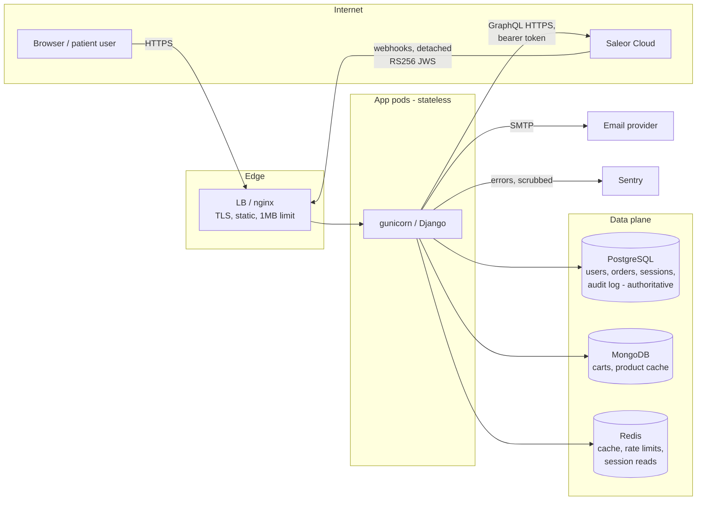

# Threat Model — Eve

Scope: the Django application on branch `security-hardening` (commit
`c403655`), its data stores, the Saleor integration (RFC 7797 detached-JWS
webhooks), and the deployment architecture in docs/DEPLOYMENT.md. Methodology: data-flow + STRIDE per
trust boundary, then OWASP Top 10 (2021) and secure-header/session checks.
Review cadence: re-run this assessment before go-live and after any change
to auth, payments, or the trust boundaries below.

## 1. System overview

## 2. Assets (what an attacker wants)

| Asset | Sensitivity | Where |
|---|---|---|
| Patient-adjacent profile data (long-term-patient flag, hospital, room) | **High — health-adjacent PII** | PostgreSQL |
| Credentials (password hashes), sessions | High | PostgreSQL (+ Redis session cache) |
| Orders / payment state | High (integrity > confidentiality) | PostgreSQL (Saleor holds payment detail) |
| Saleor API token, webhook trust, secret key | High | Env vars / vault |
| Contact messages, carts | Medium | PostgreSQL / MongoDB |
| Availability of catalogue & checkout | Medium | — |

Actors: anonymous visitor, authenticated customer, admin/staff, Saleor
(semi-trusted upstream), infrastructure providers (Railway, DB hosts),
external attacker, malicious insider.

## 3. Trust boundaries and STRIDE highlights

**B1 Internet → app.** Spoofing/DoS/injection surface. Controls: TLS+HSTS,
CSRF on all state changes, per-IP throttles + per-username lockout, input
validation, request-size caps, CSP without unsafe-inline, autoescaping.

**B2 Saleor → app (data).** Product data is untrusted input: validated
(`_is_valid_product`), sanitized (`striptags`, http(s)-only URLs) before
caching or rendering; prices never trusted from cart or client — always
recalculated by Saleor at checkout. Residual: a compromised Saleor tenant
still controls product content and image hosts (info-gathering via `img`
loads); accepted — Saleor is the commercial backbone.

**B3 Saleor → app (webhooks).** Spoofing/tampering/replay. Controls:
detached RS256 JWS verified against Saleor's JWKS (HTTPS, cached, one
forced refresh), event derived from the *signed* `__typename`, state
transitions allow-listed, idempotent re-delivery, `select_for_update`.
Replay of a captured event can only re-assert an already-valid transition.

**B4 App → data stores.** ORM parameterization (SQLi) and fixed-key pymongo
value queries (NoSQLi) hold. **Elevated trust in Redis:** Django's Redis
cache serializes with pickle, so full Redis compromise escalates to code
execution in app pods (see R2). Sessions are `cached_db` with JSON
serialization and PostgreSQL authoritative.

**B5 Operators → admin.** TOTP MFA (prod default), rate-limited login,
relocatable path, optional IP allowlist, quarterly `audit_admins` review,
privileged actions on user data audited via `PrivacyActionLog`.

**B6 Build → deploy.** Locked deps + pip-audit + gitleaks + bandit/ruff in
CI; image built from `requirements.lock`; secrets injected from vault at
runtime. Residual: base image not digest-pinned, no container scan (R8).

## 4. OWASP Top 10 (2021) assessment

| # | Category | Status | Evidence / residual |
|---|---|---|---|
| A01 | Broken Access Control | **Pass** | Every user-owned resource filtered by `request.user` (profile API, orders, cart keyed to session user); read-only viewset; tests enforce ownership + 404-on-other-user. No object IDs accepted from clients for ownership decisions. |
| A02 | Cryptographic Failures | **Pass w/ notes** | TLS enforced to every backend in prod; Argon2id password hashing for new and successfully authenticated accounts, with legacy PBKDF2 verification and automatic rehashing; signed email tokens (salted, 3-day expiry); RS256 webhook verification. Notes: at-rest encryption is an infra task (documented, not enforceable in code); Redis pickle trust (R2). |
| A03 | Injection | **Pass** | ORM only (no raw SQL); pymongo values with fixed keys; autoescaped templates, `striptags` on upstream HTML, http(s)-only external URLs; CSP `script-src 'self'`, no inline JS anywhere. XSS regression tests in place. |
| A04 | Insecure Design | **Pass w/ notes** | Fail-closed settings, checkout feature-flagged behind integration tests + webhook trust, idempotency keys, state-machine order transitions, circuit breaker. Notes: reconciliation gap for orders whose local write failed (R4); lockout can be abused against victims (R5). |
| A05 | Security Misconfiguration | **Pass w/ notes** | `check --deploy` clean and enforced in CI; DEBUG off by default; explicit cookie policy; admin hardened; env-validated backends. Note: correctness of client IPs depends on `DJANGO_TRUSTED_PROXIES`/proxy config per platform — misconfiguration degrades throttling (R1). |
| A06 | Vulnerable & Outdated Components | **Pass** | Full pinned closure (`requirements.lock`), pip-audit clean and gated in CI; 12 CVEs already remediated this cycle. Residual: base image pinning/scanning (R8). |
| A07 | Identification & Authentication Failures | **Pass w/ notes** | Argon2id is the preferred password hasher; legacy PBKDF2 hashes remain valid and upgrade on login. Session rotation on login (fixation tested), POST-only CSRF logout, per-IP throttle + cross-IP username lockout, admin MFA, Django password validators, no-enumeration password reset. Notes: Argon2's memory hardness requires login-concurrency monitoring; duplicate emails are allowed at registration (R10); email verification is tracked but not enforced (R9). |
| A08 | Software & Data Integrity Failures | **Pass w/ notes** | Signed webhooks; locked deps; secret scanning; no client-side integrity reliance. Notes: Redis pickle (R2); GitHub branch protection must be enabled manually for the CI gates to actually block (deployment step). |
| A09 | Security Logging & Monitoring Failures | **Pass** | Structured JSON logs with correlation IDs; `django.security` surfaced; auth failures, webhook rejections, transitions, and circuit events logged; redaction filters + scrubbed exception blocks; Sentry with PII scrubbing; SLOs and paging thresholds defined. |
| A10 | SSRF | **Pass** | The app fetches only two operator-configured HTTPS origins (Saleor GraphQL, JWKS — redirects disabled). No user-supplied URLs are ever fetched server-side; upstream URLs are rendered (browser-side) only after http(s) validation. |

## 5. Additional checks (OWASP ASVS / secure headers)

- Headers: CSP (no unsafe-inline), HSTS + preload (prod), `X-Frame-Options
  DENY` + `frame-ancestors 'none'`, nosniff, Referrer-Policy,
  Permissions-Policy — present and tested.
- Sessions: HttpOnly, SameSite=Lax, Secure (prod), 14-day cap, rotation on
  login, server-side invalidation on logout.
- Rate limiting: shared across workers (Redis), fail-open with paging log
  events; forms, API, admin, and password reset all covered.
- Error handling: generic user-facing messages; upstream bodies structurally
  excluded from exceptions; DEBUG off.
- Business logic: quantities bounded at three layers (form, view, checkout
  lines); prices server-side; duplicate submits idempotent.

## 6. Residual risks and recommendations (ranked)

| ID | Risk | Impact | Recommendation |
|---|---|---|---|
| R1 | **Client-IP correctness on the platform (Railway/proxy).** If `DJANGO_TRUSTED_PROXIES` doesn't match the real proxy chain, all traffic shares one `REMOTE_ADDR`: an attacker tripping a 429 throttles *everyone* (self-DoS), and the admin allowlist misbehaves. The middleware supports CIDR ranges and `X-Real-IP`, but only correct configuration activates it. | High (availability of login/checkout) | Set `DJANGO_TRUSTED_PROXIES` (e.g. Railway's `100.64.0.0/10`) + `GUNICORN_FORWARDED_ALLOW_IPS`; add a deploy-time smoke test that two different client IPs are seen distinctly. |
| R2 | **Redis compromise escalates to RCE** — Django's Redis cache pickles values, and rate limits/circuit state/JWKS cache live there. | High impact, low likelihood (requires Redis access) | Treat Redis as inside the app trust zone: require AUTH + TLS, private networking only. Optionally switch the cache to a JSON serializer for defense in depth. |
| R3 | **Saleor call amplification.** Unknown product slugs are never negatively cached and slug-misses reset the circuit breaker, so `GET /shop/product/<random>/` triggers one Saleor call each — an unauthenticated cost/DoS vector against the upstream quota. | Medium | Negative-cache slug misses for a few minutes; add per-IP GET throttling at the proxy for `/shop/`. |
| R4 | **Ambiguous checkout completion.** A response can be lost after Saleor creates an order but before Eve commits its local order. | Low/Medium (money/state divergence) | A durable `CheckoutAttempt` is written before mutation, its non-sensitive idempotency token is attached to Saleor metadata, uncertain attempts cannot be resubmitted, and hourly reconciliation repairs the local order transactionally. Manual review remains necessary if an order falls outside the configured reconciliation window. |
| R5 | **Deliberate lockout of victims:** 10 bad passwords on someone else's username locks them out 15 min (classic lockout tradeoff). | Low–medium | Accept short window; consider CAPTCHA after N failures instead of hard lock, and notify the account owner by email on lockout. |
| R6 | **No in-app payment capture step.** `checkoutComplete` is called without a payment-gateway flow; real charging depends on Saleor-side configuration. Safe today only because `CHECKOUT_ENABLED=False`. | High if flag flipped early | Keep the flag off until a gateway flow (Saleor payment app / transaction API) exists and the integration suite covers a real payment; already encoded in the runbook — do not weaken it. |
| R7 | Readiness endpoint publicly reveals which backend is down and circuit state. | Low | Restrict `/healthz/ready/` to internal networks at the proxy; keep `/healthz/live/` public if the LB needs it. |
| R8 | Container supply chain: base image tag not digest-pinned; no image vulnerability scan. | Low–medium | Pin `python:3.13-slim@sha256:...`; add Trivy (or equivalent) to CI. |
| R9 | Email verification is recorded but nothing requires it. | Low | Gate checkout (when enabled) and contact-visible features on `email_verified`. |
| R10 | Registration allows multiple accounts per email address. | Low | Enforce case-insensitive unique email at the form + a DB constraint; mind the enumeration tradeoff (return a neutral error). |

## 7. Mitigation status

Implemented on this branch after the initial assessment:

- **R1** — `manage.py check --deploy` now warns (`eve.W001`) when
  `DJANGO_TRUSTED_PROXIES` is unset; CI gates on warnings, so a deploy
  without proxy configuration fails loudly. Middleware already supports
  CIDR + `X-Real-IP` (Railway: `100.64.0.0/10`).
- **R2** — the Redis cache now uses `SafeJSONSerializer` (JSON, ints raw
  for INCR) instead of pickle: a compromised Redis can corrupt state but
  not execute code.
- **R3** — unknown product slugs are negatively cached for 5 minutes;
  repeated probing no longer costs one Saleor call per request.
- **R4** — `manage.py reconcile_orders [--fix]` compares recent Saleor
  orders with the local table, reports divergence, and can recreate
  missing records for matched users. Run daily; alert on mismatches.
- **R5** — crossing the lockout threshold emails the account owner once
  per window (silent for nonexistent usernames — no enumeration signal).
- **R9** — checkout (when enabled) refuses to place orders until the
  account's email is verified; the receipt address is therefore always
  confirmed.
- **R10** — one account per email address, case-insensitive: validated in
  the registration form and enforced by a partial unique index on
  `LOWER(email)`. The existence signal the form error reveals is bounded
  by the registration rate limit.

Still open: R6 (payment gateway — gated by the go-live runbook), R7
(restrict readiness endpoint at the proxy), R8 (digest-pin base image,
container scanning).

## 8. Explicitly accepted risks

- Saleor is trusted for product content and payment state (commercial
  dependency); its data is nonetheless validated/sanitized on ingress.
- Rate limiting and lockout **fail open** when Redis is down (availability
  over brute-force protection), compensated by paging on the failure logs.
- Mock catalogue fallback intentionally serves static demo data during
  Saleor outages.
- `.env` files exist for local development only; production uses a vault.
